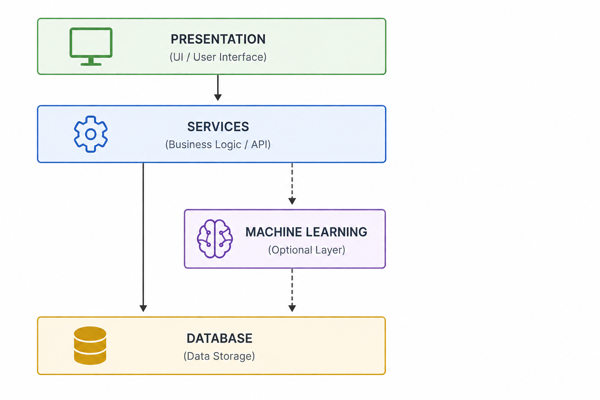
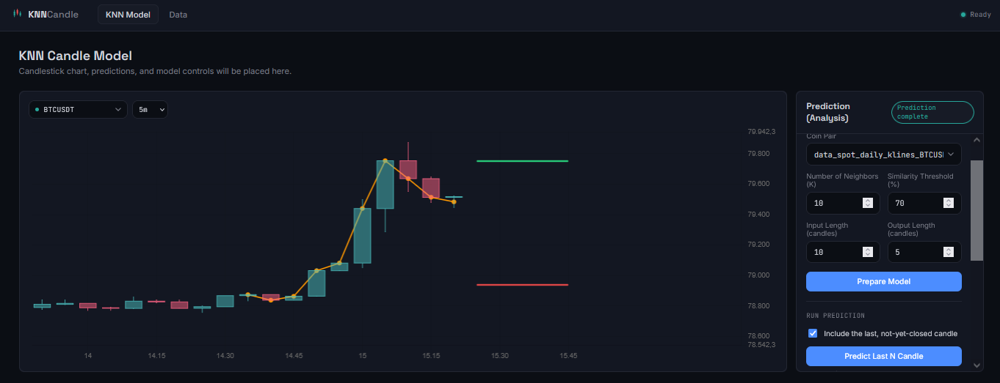
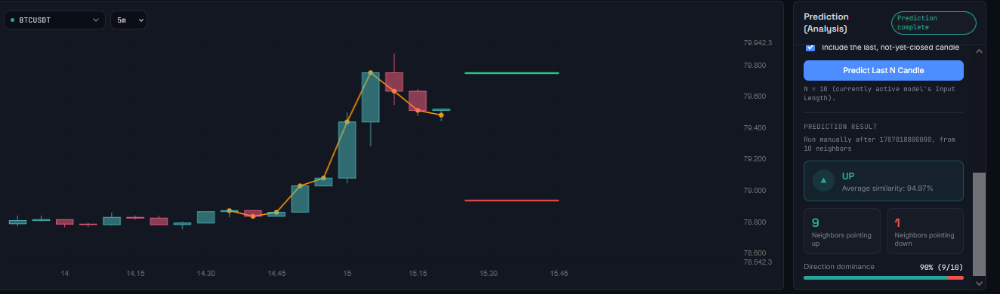

# KNN Candle Pattern Analysis

If conventional traders analyze historical price patterns to anticipate the next market movement, why not use **K-Nearest Neighbors (KNN)** to do the same process systematically?

This project uses KNN to find **similar historical candle patterns** and estimate the probability of the next price movement based on what happened after those similar patterns in the past.

Instead of relying only on visual pattern recognition, the system attempts to:

* Identify similar historical candle patterns.
* Find the nearest historical patterns using KNN.
* Analyze what happened after those patterns.
* Calculate the probability of potential price movements.
* Present the analysis through a simple application interface.

## System Architecture

The project is organized into several layers:

* **Presentation** — User interface for interacting with the system.
* **Services** — Handles business logic and communication between components.
* **Machine Learning** — KNN-based pattern analysis and probability calculation. This layer is optional and can be bypassed when the application only needs to communicate directly with the database.
* **Database** — Stores the historical market data and related information.

The overall system architecture is shown below:



## Demo

### Demo 1



### Demo 2



## Project Structure

```text
.
├── database/
├── machine_learning/
├── presentation/
├── services/
├── architecture.png
├── demo_1.png
├── demo_2.png
└── main.py
```

## Concept

The core idea is simple:

**Historical patterns → Find similar patterns with KNN → Analyze subsequent movements → Estimate probability**

The goal is not to claim that KNN can predict the market with certainty, but to provide a **data-driven way of analyzing historical patterns and their subsequent outcomes**.
